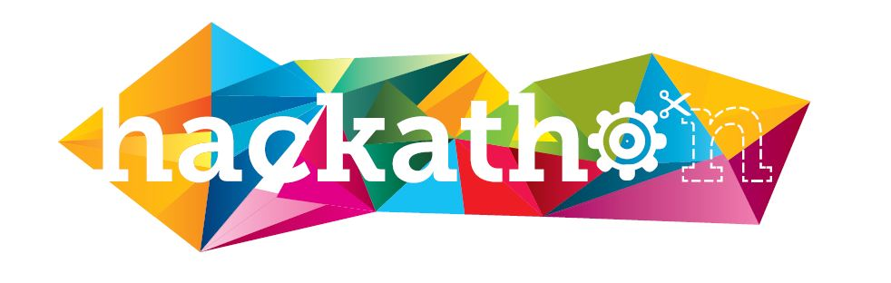

# TransMapper: Transform the way of Mapping census data 

  
# Description: 
TransMapper is a light weighted web mapping application focusing on visualizing numeric data using the cartogram map, a map on which statistical information is shown in diagrammatic form. The project was the project submitted to 2013 Ohio State Big Data Hackathon sponsored by Google, Hortonworks, Teradata and USG,. The project is conceived, planned, executed and developed in 24 hours.

# Preview: 
Census Data

Example Cartogram

Example Cartogram

Text Cloud of Words in Census Variable Names

Wordle of Words in Census Variable Names

WIKI: 
[Help](https://github.com/davidchengo/geovis/blob/master/help.html)
 
[Data Description](https://github.com/davidchengo/geovis/blob/master/meta.htm)

Installation: 
The installation is simple. Download the entire repository onto your desk and double click on on the index.html to launch the web application. (Tested on all major browsers: Firefox, IE, Safari, and Chrome)

Usage: 
1. Once the respository is downloaded, double click the index.html in root of the repository.
2. Choose a variable (one of the hundreds of census variables) from the dropdown list to create a cartogram map.
3. You will see the distortion and resizing of each region on the map approportional to scale of the value of the variable.
4. Hover over each region to see the exact value.
5. You may also click on the >>> button to bring up the text/voice search. Give a key word and it will match all variables by either text or sound. This is an example of leveraging NLP to make data visualization more interactive.

Techniques: 
Implementation was based on using 6 Javascript libraries: d3.v2.min.js (for core visualization), cartogram.js (for geographic data cartogram transformation), natural.js (for NLP), topojson.js (for geotransforming geographic objects), jquery-1.10.2.min.js (for utility functions) and colorbrewer.js (for blind safe colors for mapping).

Credits:  
The core cartogram algorithm using d3.js was based on the previous work by [Shawn Allen](https://github.com/shawnbot/d3-cartogram/). Project finished by three developers (David (myself), Lucky, and Jakob).

